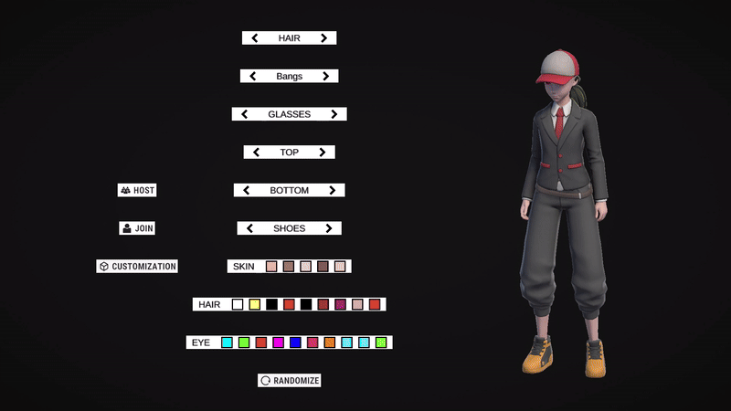

# SteamMultiplayer3D

## Overview

**SteamMultiplayer3D** is a small 3D multiplayer game created as a 
demonstration of some of my skills in Unity.

## Features

- **Multiplayer Lobby** — Players can join via Steam and see each other's nicknames and character skins.
- **Character Customization** — Each player can select a skin, which is synchronized across the network.
- **Synchronized Interactions** — Players can interact with UI panels to open doors, use computers, and 
trigger events, all synced in real time.
- **Computer Interface** — A simple in-game computer interface with multiple file options.
- **IK-Based Character Animation** — Head, upper body, and right arm (with flashlight) respond dynamically 
to the player's view direction using inverse kinematics.

## Used technologies

Mirror, FizzySteamworks, Animation Rigging (IK), Cinemachine, Zenject (Dependency Injection), Unity Input System... 

## Demonstration GIF's (may take some time to load)

### Character Customization

### Synchronized Events

### Computer Interaction
